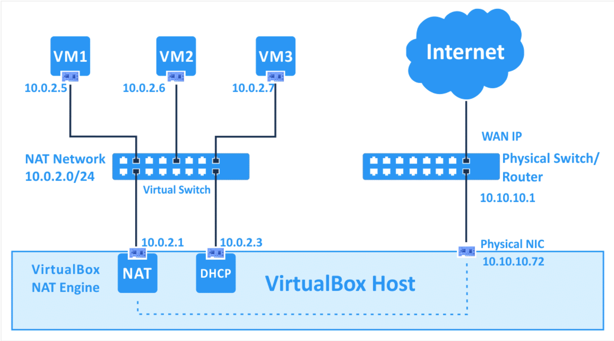

This post aims to introduce how to quickly configure your VS Code installed in Host (a.k.a. local machine) to develop in Guest (i.e. remote machine, remote server, virtual machine in VirtualBox or Cloud)

## Step 1: Create a Virtual Machine (VM)

Please refer to [Install SEED VM on VirtualBox](https://github.com/seed-labs/seed-labs/blob/master/manuals/vm/seedvm-manual.md). Skip if you have one.

> username: seed  
> password: dees


Following figure shows how NAT Network looks like. Please refer to [VirtualBox Network Settings: Complete Guide](https://www.nakivo.com/blog/virtualbox-network-setting-guide/) or [Virtual Networking](https://www.virtualbox.org/manual/ch06.html) if interesed.


## Step 2: Set Up SSH Server Service in VM

```bash
## Install sshd server
sudo apt install openssh-server

## Start server and check status
sudo service ssh start
sudo service ssh status

## Further config sshd server only when needed
# sudo vim /etc/.ssh/sshd_config
# sudo service ssh restart

## Verify ssh login
# tip: use `whoami` to display your username
ssh seed@127.0.0.1
```

## Step 3: Add Port Forwarding Rule in VirtualBox

Go to VirtualBox/Preferences/Network, edit your NATNetwork and select Port Forwarding. Add Rules as follows.

> Name: SSH (any arbitrary unique name)  
> Protocol: TCP  
> Host IP: 127.0.0.1 (any available ip of your local machine)  
> Host Port: 8022 (any unused port higher than 1024)  
> Guest IP: 10.0.2.5 (type `ifconfig` in terminal of VM to check)  
> Guest Port: 22 (SSH default port)


## Step 4: Set Up SSH Client Service in Host

### Install ssh client

For macOS Host, it comes pre-installed. For Ubuntu Host, Debian/Ubuntu Run `sudo apt-get install openssh-client`. For other OS, please refer to [Install a supported SSH client](https://code.visualstudio.com/docs/remote/troubleshooting#_installing-a-supported-ssh-client).

### Now you can connect VM by SSH

```bash
ssh seed@127.0.0.1 -p 8022
```

### _Bonus_

If you want to login without password, you need to do the following substeps in Ubuntu Host.

```bash
# Lists the files in your .ssh directory, if they exist
ls -al ~/.ssh

# Generate new key if needed
ssh-keygen -t ed25519 -C "your_email@example.com"

# Start the ssh-agent in the background
eval "$(ssh-agent -s)"

# Add your SSH private key to the ssh-agent
ssh-add -K ~/.ssh/id_ed25519

# copy public key to VM
ssh-copy-id seed@127.0.0.1 -p 8022

# Now try again to login without password
ssh seed@127.0.0.1 -p 8022
```

Please refer to [How to Set Up SSH Keys on Ubuntu 20.04](https://www.digitalocean.com/community/tutorials/how-to-set-up-ssh-keys-on-ubuntu-20-04) or [Connecting to GitHub with SSH](https://docs.github.com/en/authentication/connecting-to-github-with-ssh) for more info.

If you want further simplify the connection, open `~/.ssh/config` in Ubuntu Host and append the following config.

```ssh_config
Host sd
    HostName 127.0.0.1
    User seed
    # replace id_ed25519 with your secret key
    IdentityFile ~/.ssh/id_ed25519
    Port 8022
```

Now try to login by

```bash
ssh sd
```

## Step 5: Use VSCode Remote SSH Plugin

Install VSCode and the following recommended plugin:

> ### Remote
>
> Remote - SSH  
> Remote - SSH: Editing Configuration Files
>
> ### Hex
>
> Hex Editor (or hexdump for VSCode)
>
> ### _Bonus: C/C++_
>
> C/C++  
> CMake  
> CMake Tools

Check the plugin details to learn how to use it (quite easy)! I also provide several plugins that I prefer beyond our class.

> Code Runner  
> Visual Studio Intellicode
>
> ### _Bonus: Markdown_
>
> Markdown All in One  
> Markdown Preview Enhanced  
> markdownlint
>
> ### _Bonus: Formatter_
>
> Prettier  
> Bracket Pair Colorizer 2  
> indent-rainbow
>
> ### _Bonus: Git_
>
> GitLens  
> Git Graph  
> gitignore

## Q&A

Q: How to beautify my terminal

A: [Oh My Zsh](https://github.com/ohmyzsh/ohmyzsh) is all you need.
